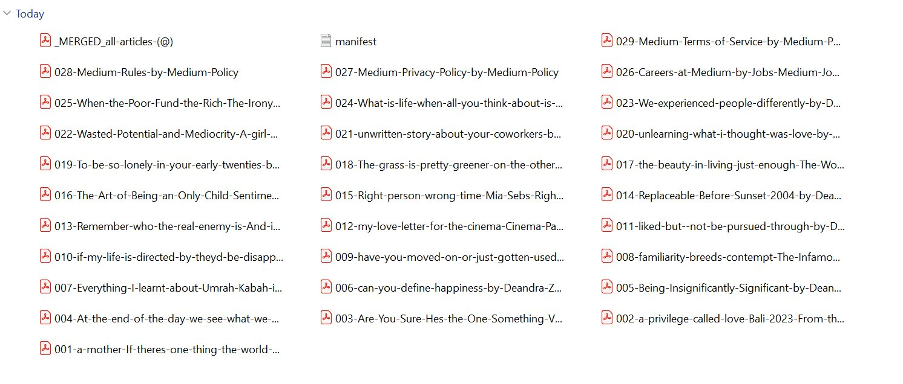

# medium2pdf-scraper

a small command line tool for archiving everything someone wrote on medium, exported as searchable pdfs in a zip. one for each article, plus one big merged pdf with bookmarks for the whole archive.

## why this exists

i wanted to feed a medium author's full back catalog into an llm for personal research. medium's rss feed only gives you the latest ten posts. unofficial apis make you query each url one at a time, and you don't get the article body, just metadata. browser extensions like webxpdf are great for one page at a time but painful when you want everything.

so i made this. you give it a profile url. it scrolls the profile to find every article ever published, renders each one as a clean text-selectable pdf, merges them into a single bookmarked pdf, and zips the whole thing.

## what you get

after one run, the output folder looks like this:

```
medium-username-20260105-142233.zip
├── _MERGED_all-articles-username.pdf      ← every article in one file, with bookmarks
├── 001-first-article-title.pdf
├── 002-second-article-title.pdf
├── 003-...pdf
│   ...
├── 024-last-article-title.pdf
└── manifest.txt                           ← maps each pdf back to its source url
```

the merged pdf opens with a clickable outline panel in any pdf reader, so you can jump straight to whichever article you want. the individual pdfs are there if you'd rather work with them separately, for example feeding them into a vector store one at a time.

## demo



## requirements

* python 3.10 or newer
* google chrome installed (the script drives your real chrome to get past medium's cloudflare bot checks. the bundled headless browser gets blocked instantly.)

## setup

run these once, before your first archive:

```bash
python -m pip install playwright pypdf
python -m playwright install chromium
```

windows tip: if `pip` says it's not recognized, use `python -m pip` instead. that always works because the python launcher is on your path even when pip isn't.

## usage

basic. archive every article from a profile.

```bash
python medium2pdf.py https://medium.com/@username
```

smoke test. just save the 2 most recent articles before committing to a full run. always do this first when scraping a new profile.

```bash
python medium2pdf.py https://medium.com/@username --max 2
```

dry run. just collect the article urls without rendering anything.

```bash
python medium2pdf.py https://medium.com/@username --list-only
```

custom output folder.

```bash
python medium2pdf.py https://medium.com/@username -o ./my-archive
```

slow it down to be polite. default is 2.5 seconds between articles.

```bash
python medium2pdf.py https://medium.com/@username --delay 5
```

### a note on the chrome window

when the script runs, a real chrome window will open and start navigating to articles by itself. don't close it. don't click anything. let it work. it's not stuck, it's just waiting on cloudflare to release each page.

when an article hits a cloudflare check (you'll see "just a moment..." in the title bar), the script waits up to 45 seconds for the challenge to clear before printing. usually it clears in 3 to 5 seconds.

headless mode would be faster but cloudflare blocks it, which is why we go visible.

## how long does it take

about 20 to 30 seconds per article on a normal connection. for an author with 24 articles, plan on 8 to 15 minutes. the terminal prints progress the whole time so you can watch it work.

## troubleshooting

most issues fall into one of these buckets.

### "pip is not recognized as an internal or external command"

on windows, run `python -m pip install ...` instead of `pip install ...`. same outcome, no path issues.

### "ERROR: Playwright is not installed" but i just installed it

did you also run `python -m playwright install chromium`? installing the python package and the browser binaries are two separate steps and both are needed.

### the firewall is asking to allow chrome

allow it. on managed laptops where you can't allow new apps, the script may still work because it uses your installed chrome which is already approved by your it policy.

### every pdf says "performing security verification"

this means cloudflare won the staring contest. things to try in order:

1. make sure google chrome is installed. the script tries chrome first, then edge, then bundled chromium. only real chrome reliably gets past cloudflare on medium.
2. raise `--delay` to 5 or higher. fast sequential requests look botty.
3. close any other chrome windows you have open before running. sometimes profile conflicts cause weird behavior.
4. try again later. cloudflare's defenses fluctuate.

### the script finds 0 articles

your profile url might be wrong. it should look like `https://medium.com/@username` (with the @ symbol). if the user has a custom domain like `username.medium.com` that also works.

### some articles fail but most succeed

normal. medium occasionally serves a paywalled preview or a stricter challenge for specific posts. check `manifest.txt` for the failures section, which tells you what broke and why.

### i wrote the wrong path and it can't find the script

the file has to be in the folder you're running the command from. if your file is at `C:\Users\me\Downloads\medium2pdf-scraper\medium2pdf.py`, you have to either `cd` into that folder first or pass the full path: `python C:\Users\me\Downloads\medium2pdf-scraper\medium2pdf.py https://medium.com/@username`.

## what this tool does not do

* it does not get behind member-only paywalls. you'll get the public preview for those articles. if you want the full text, you'd need to plug in your own logged-in cookies via playwright's `storage_state`.
* it does not bypass aggressive cloudflare configurations. if a profile is fully challenge-locked even to real chrome, this won't help. there are paid services for that.
* it does not download comments or response threads beyond what fits on the article page.
* it does not run on a schedule. you run it when you want a snapshot.
* it does not try to fingerprint or impersonate anyone. it just opens a real browser and reads public pages.

## how it works

three phases.

**discovery.** the script opens the profile in chrome, scrolls to the bottom in a loop, and collects every link whose path ends in medium's twelve character article hash (the `-a1b2c3d4e5f6` suffix that every medium article url has). it stops when 4 scrolls in a row produce no new links.

**rendering.** for each article url, it opens a tab, waits past any cloudflare interstitial, hides sticky banners and signup popups with injected css, scrolls once end to end so lazy loaded images appear, then calls chrome's print to pdf with a4 paper. text stays selectable. images come along. code blocks render normally.

**packaging.** the individual pdfs are renamed from their titles, all of them are merged into one big pdf using pypdf with one bookmark per article, a manifest.txt is written, and the whole work folder gets zipped.

## why pdf

i originally wanted markdown. but pdf preserves the look of the article (images, layout, embedded media) and stays readable forever even if medium changes their html in the future. for ml ingestion you can re extract text from pdf with pdfplumber or pypdf in two lines. for human reading you get the article as it actually looks, minus the popups.

if you'd rather have html or markdown, the code in `save_article_as_pdf` is easy to swap. just replace `page.pdf(...)` with `page.content()` and pipe the result through `markdownify` or `trafilatura`.

## a fair warning

medium's terms of service restrict automated access. this tool is fine for personal archiving of authors you actually read, or for snapshotting your own writing as backup. don't use it to redistribute someone's work, train commercial models on their writing without permission, or run it at a scale that strains medium's infrastructure. the writers don't get paid by you scraping them.

if you publish derivative work based on what you scraped, credit the original author and link back to medium.

## contributing

the code is short. one file. if you fix a bug or add something useful, open a pr. ideas welcome:

* logged-in mode for member-only articles
* markdown output as an alternative to pdf
* incremental mode that only fetches articles newer than the last run
* support for medium publications, not just user profiles
* parallel rendering with rate limit handling

## license

do whatever you want with the code. just don't blame me when medium changes their site and it breaks. :\
